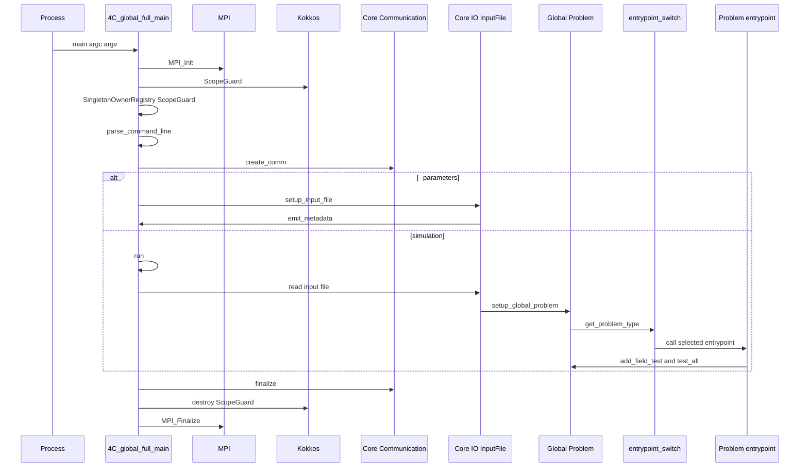

# Application Lifecycle

The main executable is implemented in `apps/global_full`. Its runtime spine is `apps/global_full/4C_global_full_main.cpp`, and the physics dispatch table is `apps/global_full/4C_global_full_entrypoint_switch.cpp`. Build ownership is described in [Build and Runtime Topology](build-and-runtime.md); this page explains what happens after the `4C` binary starts.

## Startup and shutdown sequence

This sequence shows the executable-level lifecycle and where physics code enters.

## Main responsibilities

`main()` is deliberately thin but owns process-wide lifetime. `parse_command_line()` uses CLI11 and adapts legacy argument spellings before parsing. It recognizes `--ngroup`, `--glayout`, `--nptype`, `--restart`, `--restartfrom`, `--parameters`, `--interactive`, the primary input/output pair, and extra input/output pairs for nested parallelism. `--glayout` is parsed as a comma-separated positive-integer list. `--nptype` accepts `separateInputFiles`, `everyGroupReadInputFile`, `nestedMultiscale`, and `diffgroup0` or `diffgroup1`; `diffgroup` stores a comparison group id while disabling nested parallelism. `--restart` accepts non-negative steps or `last_possible` as `-1`, also as comma-separated per-group values. `--restartfrom` similarly stores per-group restart identifiers. After parsing, communicator creation consumes `group_layout`, `nptype`, and `diffgroup`; global problem setup consumes the input/output pairs, restart-per-group values, and restart identifiers to configure restart state and group-local input/output.

`main()` owns these process-wide steps:

- initializes MPI and finalizes it via a local RAII cleanup object;
- creates `Kokkos::ScopeGuard` immediately after MPI;
- creates `Core::Utils::SingletonOwnerRegistry::ScopeGuard` so registered singletons are cleaned up deterministically;
- parses command-line arguments through `parse_command_line`;
- builds `Core::Communication::Communicators` from `group_layout`, `nptype`, and `diffgroup`;
- optionally pauses in interactive attach mode;
- prints version, git SHA, Trilinos hash, and MPI rank count;
- optionally enables floating-point exception trapping when `FOUR_C_ENABLE_FE_TRAPPING` is compiled in;
- catches `Core::Exception`, prints `what_with_stacktrace()`, coordinates global barriers for multi-group runs, and aborts MPI unless core dumps are requested;
- prints high-water memory and normal-finish messages before communicator finalization.

The order is an invariant: MPI precedes Kokkos and communicators, input reading happens after ParObject type registration, calculation happens after `setup_global_problem`, and result tests happen inside the selected problem entrypoint.

## `run()` phases

`run(CommandlineArguments&, Communicators&)` has two timed phases.

### Input phase

1. `update_io_identifiers(cli_args, communicators.group_id())` adjusts output identifiers for grouped runs.
2. `global_legacy_module_callbacks().RegisterParObjectTypes()` forces side-effect registration of parallel object types before communication and unpacking.
3. `setup_input_file(communicators.local_comm())` returns a schema-aware `Core::IO::InputFile`.
4. `input_file.read(cli_args.input_file_name)` reads YAML, JSON, and included files on rank 0 and distributes non-legacy sections.
5. `setup_global_problem(input_file, cli_args, communicators)` populates `Global::Problem` with parameters, discretizations, materials, functions, output control, restart data, and communication state.
6. A local communicator barrier prevents one rank from entering calculation while another is still reading or throwing.

Input construction is detailed in [Input Schema and Global Problem](input-schema-global-problem.md).

### Calculation phase

`entrypoint_switch()` reads `Global::Problem::instance()->get_problem_type()` and calls the corresponding runtime function. After the selected physics routine returns, `write_timemonitor` writes timing output.

## Problem-type dispatch

The dispatch switch is the authoritative map from input problem type to runtime entrypoint:

| Problem type group | Entrypoint | Canonical behavior page |
| --- | --- | --- |
| `structure`, `polymernetwork` | `caldyn_drt()` | [Structure and Solid Elements](../physics/structure-and-solid-elements.md) |
| `fluid`, `fluid_redmodels` | `dyn_fluid_drt(restart)` | [Fluid and ALE](../physics/fluid-and-ale.md) |
| `fluid_ale` | `fluid_ale_drt()` | [Fluid and ALE](../physics/fluid-and-ale.md) |
| `fluid_xfem` | `fluid_xfem_drt()` | [Fluid and ALE](../physics/fluid-and-ale.md) and [Cut and XFEM Geometry](../physics/cut-xfem-geometry.md) |
| `scatra` | `scatra_dyn(restart)` | [Scalar Transport and Electrochemistry](../physics/scalar-transport-electrochemistry.md) |
| `cardiac_monodomain` | `scatra_cardiac_monodomain_dyn(restart)` | [Scalar Transport and Electrochemistry](../physics/scalar-transport-electrochemistry.md) |
| `sti`, `tsi`, `ssti`, `thermo`, `elch`, `loma` | `sti_dyn`, `tsi_dyn_drt`, `ssti_drt`, `thermo_dyn_drt`, `elch_dyn`, `loma_dyn` | [Scalar Transport and Electrochemistry](../physics/scalar-transport-electrochemistry.md) |
| `fsi`, `fsi_redmodels` | `fsi_ale_drt()` | [Coupled Multiphysics](../physics/coupled-multiphysics.md) |
| `fsi_xfem`, `fpsi_xfem`, `gas_fsi`, `biofilm_fsi`, `thermo_fsi`, `fps3i`, `fbi`, `fpsi`, `ssi`, `ssti`, `pasi` | specialized coupled entrypoints | [Coupled Multiphysics](../physics/coupled-multiphysics.md) |
| `poroelast`, `poroscatra`, pressure-based porofluid variants | poro/porofluid entrypoints | [Poro, Particle, Lung, and Network Models](../physics/poro-particle-lung.md) |
| `particle` | `particle_drt()` | [Poro, Particle, Lung, and Network Models](../physics/poro-particle-lung.md) |
| `art_net`, `red_airways`, `reduced_lung`, `one_d_pipe_flow`, `cardiovascular0d` related models | arterial, airway, lung entrypoints | [Poro, Particle, Lung, and Network Models](../physics/poro-particle-lung.md) |
| `ale`, `level_set`, `lubrication`, `ehl` | ALE/level/lubrication/EHL entrypoints | [Fluid and ALE](../physics/fluid-and-ale.md), [Cut and XFEM Geometry](../physics/cut-xfem-geometry.md), [Coupled Multiphysics](../physics/coupled-multiphysics.md) |

If no case matches, the switch throws with the unknown `ProblemType`.

## Result-test contract

Most problem entrypoints follow the same tail pattern:

1. create or reuse field algorithms/adapters;
2. run restart or post-setup;
3. run `integrate`, `time_loop`, or `timeloop`;
4. create field-specific result tests;
5. call `Global::Problem::instance()->test_all(comm)`.

This means regression input files can validate solver behavior without a separate external harness. The test infrastructure is documented in [Testing and Validation](testing-validation.md).
