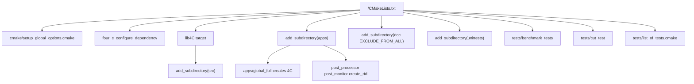

# Build and Runtime Topology

4C is a C++20 CMake project whose repository-level composition root is `/CMakeLists.txt`. The top-level build does four things before any physics code is compiled:

1. rejects in-source builds;
2. reads `/VERSION` and `/input_version/INPUT_VERSION` and turns them into configured version variables;
3. configures dependencies and global options; and
4. creates the single library target `lib4C` that every module extends.

The runtime pages build on this page: the produced `4C` executable is described in [Application Lifecycle](application-lifecycle.md), while input-schema construction is described in [Input Schema and Global Problem](input-schema-global-problem.md).

## Target graph



This diagram shows the top-level CMake ownership of build outputs.

`lib4C` is intentionally broad: the top-level `CMakeLists.txt` creates `FOUR_C_LIBRARY_NAME` as `lib4C`, then `src/CMakeLists.txt` adds every module directory. Most module `CMakeLists.txt` files call `four_c_auto_define_module()` and then `four_c_add_internal_dependency(...)`; this is the source of the module-dependency map used by [Module Catalog](../modules/catalog.md). `src/core/CMakeLists.txt` uses `four_c_auto_define_module(NO_CYCLES)`, so core is the acyclic base for communication, FEM, IO, linear algebra, geometric search, utilities, and rebalance.

`four_c_auto_define_module()` creates a `<module>_objs` object library with a dummy source so even header-only or generated modules have a target, and a `<module>_deps` interface library for usage requirements. The object target links private compile settings, the deps target links default external libraries and `config_deps`, and `lib4C` links every module's deps publicly and objects privately. Headers are exported as a `FILE_SET HEADERS` rooted at `/src`, while include directories use the build directory directly and the install include directory with the module-relative path. In static builds the object target is also installed; otherwise the dependency interface and headers are exported through `4CTargets`. In developer mode, modules marked `NO_CYCLES` get a real `4C_<module>` library and `<module>_module` alias for faster unit-test linking; other modules alias `<module>_module` to the global `lib4C` target.

## Dependencies

The top-level dependency block configures required dependencies:

- `HDF5`, `MPI`, `Qhull`, `Trilinos`, `Boost`, `CLN`, `ryml`, `magic_enum`, `ZLIB`, and `CLI11`.

Optional dependencies are configured with defaults: `VTK`, `gmsh`, `deal.II`, `ArborX`, `FFTW`, `MIRCO`, `Backtrace`, `Python`, and `pybind11`. Optional source directories follow these switches. For example, `src/deal_ii` is only added when `FOUR_C_WITH_DEAL_II` is true, and optional Python bindings are added only through `cmake/setup_py4C.cmake` when `FOUR_C_ENABLE_PYTHON_BINDINGS` is true.

Important invariants:

- C++ standard is C++20 with compiler extensions off.
- CMake module scanning is disabled because 4C does not use C++ modules yet.
- `CMAKE_EXPORT_COMPILE_COMMANDS` is enabled for tooling.
- Build types are restricted to `DEBUG`, `RELEASE`, and `RELWITHDEBINFO`.
- MPI test launch options are centralized in `FOUR_C_MPIEXEC_ARGS_FOR_TESTING`.

## Applications and full target

`apps/CMakeLists.txt` adds four application families:

| App directory | Runtime role | Canonical documentation |
| --- | --- | --- |
| `apps/global_full` | Main simulation executable named by `FOUR_C_EXECUTABLE_NAME`, normally `4C`. | [Application Lifecycle](application-lifecycle.md) |
| `apps/create_rtdfiles` | Runtime documentation or metadata generation helper. | [Apps and Tooling](../tools/apps-postprocessing.md) |
| `apps/post_processor` | Converts or writes post-processing output through `src/post`. | [Apps and Tooling](../tools/apps-postprocessing.md) |
| `apps/post_monitor` | Monitors post-processing/result data. | [Apps and Tooling](../tools/apps-postprocessing.md) |

The top-level `full` target depends on the main executable and the auxiliary application targets `post_processor`, `post_monitor`, `create_rtd`, and `cut_test`. If GoogleTest is enabled, `setup_tests.cmake` also creates a `unittests` target and adds it to `full`.

## Documentation, install, and tests

`doc/CMakeLists.txt` is excluded from the default all target. `/doc/README.md` documents local documentation builds through the `documentation` target and Doxygen through `FOUR_C_ENABLE_DOXYGEN=ON` plus the `doxygen` target.

Tests enter from three places:

- `unittests` uses GoogleTest and module-local `four_c_auto_define_tests(...)` calls. See [Testing and Validation](testing-validation.md).
- `tests/benchmark_tests` contains Google Benchmark targets when `FOUR_C_WITH_GOOGLE_BENCHMARK` is enabled.
- `tests/cut_test` builds a large standalone `cut_test` executable from many geometry regression sources.
- `tests/list_of_tests.cmake` registers the YAML/dat regression input suite.

Installation rules are included from `cmake/setup_install.cmake`. The install-test templates under `tests/install_test` are configured by `cmake/setup_tests.cmake`.

## Minimal validation commands

Use the project presets and commands from repository documentation when available. The narrowest build-graph checks are:

```bash
cmake -S . -B build --preset=docker -DCMAKE_BUILD_TYPE=DEBUG
cmake --build build --target 4C
cmake --build build --target unittests
ctest --test-dir build --output-on-failure
```

For a page-specific change, prefer the module test or app target in the related page before running the full regression suite.
