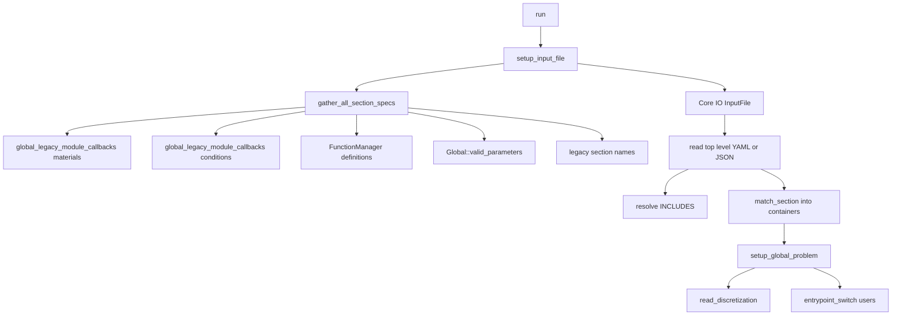

# Input Schema and Global Problem

4C input is not owned by one physics module. The main executable asks `setup_input_file(...)` for a `Core::IO::InputFile`; that object is built from global sections, module callbacks, material definitions, condition definitions, function definitions, and legacy mesh sections. The initialized data is stored in `Global::Problem`, which is later queried by every problem entrypoint described in [Application Lifecycle](application-lifecycle.md).

## Input construction flow

This flow shows that the runtime schema is assembled before the input file is interpreted.

## `Core::IO::InputFile`

`src/core/io/src/4C_io_input_file.hpp` defines the format-independent input facade. Its important invariants are:

- sections may appear in any order but section names must be unique;
- `INCLUDES` is special and may list additional files with independent formats;
- `TITLE` is special and may contain arbitrary descriptive data;
- `input_version` stores input compatibility metadata;
- `.yaml`, `.yml`, and `.json` are detected by extension, and unsupported extensions throw;
- include paths in `INCLUDES` are interpreted relative to the file that contains the include unless they are absolute, and included paths must name regular files;
- include cycles or duplicate includes are rejected because every newly included file is checked against the already-read include list;
- rank 0 reads the file and distributes non-legacy sections to other ranks;
- legacy sections are accessed only on rank 0 via `in_section_rank_0_only()` and are intentionally removed from the broadcast tree to save memory;
- duplicate section names across the top-level file and includes are rejected with a `Section ... is defined more than once` error;
- after reading, rank 0 validates every top-level key as a user section or reserved section, so unknown sections fail before problem setup;
- `input_version` is matched as an optional validated version string; matching versions print compatibility, mismatches print a warning that the input may be incompatible;
- schema-aware sections are matched with `match_section(...)` into `InputParameterContainer`;
- `emit_metadata(...)` writes the known input schema and is used by the `4C --parameters` path.

New code should prefer `InputSpec` and `match_section` over parsing the deprecated dat-style string returned by `Fragment::get_as_dat_style_string()`.

## Section-spec sources

`src/global_data/4C_global_data_read.cpp` builds the schema in `gather_all_section_specs()`:

| Source | Contribution |
| --- | --- |
| Contact constitutive law registry | `CONTACT CONSTITUTIVE LAWS` section. |
| FEM cloning map | `CLONING MATERIAL MAP`. |
| Result-test callback | `RESULT DESCRIPTION`. |
| Material callbacks | `MATERIALS` list with `MAT` id and `_material_type` storage. |
| Function callbacks | `FUNCT<n>` sections; this is intentionally a compatibility bridge. |
| Condition callbacks | condition sections from module definitions. |
| `Global::valid_parameters()` | global and problem-specific parameter groups from `src/inpar` and related modules. |
| Legacy section names | element, node-coordinate, topology, and particle sections that are accepted without full `InputSpec` validation. |

The callback surface is documented in [Module Registration and Extension Surfaces](../extension/module-registration.md).

## Metadata emission

When the command-line `parameters` mode is active, `main()` creates a YAML tree, calls `emit_general_metadata(root_ref)`, constructs an `InputFile`, calls `input_file.emit_metadata(root_ref)`, and prints the tree. The general metadata contains:

- commit hash and 4C version;
- input description section name;
- legacy element specs from `Core::Elements::ElementDefinition`;
- particle specs from `Particle::create_particle_spec()`;
- cell type names and number of nodes.

The Python tooling page explains how `utilities/four_c_python` turns this metadata into schemas and validates test input files.

## Discretization reading

`Global::read_discretization(...)` creates a `Core::IO::MeshReader` with `Core::Rebalance::RebalanceParameters` taken from `MESH PARTITIONING`, geometric-search parameters, and IO parameters. It then selects discretization kinds from the problem type and spatial approximation:

- `plain` for standard FEM discretizations;
- `faces` for face-enhanced setups;
- `nurbs` for NURBS spatial approximation;
- `xwall`, `xfem`, and `hdg` for specialized fluid and discontinuous variants.

The resulting named discretizations are stored in `Global::Problem` and later requested through `get_dis("structure")`, `get_dis("fluid")`, `get_dis("scatra")`, `get_dis("ale")`, `get_dis("thermo")`, and similar names. Fill-complete order is a physics invariant and is covered in [FEM Discretization](../core/fem-discretization.md) and the relevant physics pages.

## Global problem access pattern

`Core::IO::read_parameters_in_section(...)` is the bridge from matched containers to `Teuchos::ParameterList`. It calls `input.match_section(section_name, container)` and then converts the whole container to a list. If a container has a group named like the section and the section name contains slash-separated nesting, `find_sublist` creates nested `Teuchos::ParameterList` entries before conversion. `Global::read_parameter` iterates the parameter specs supplied by global/module callbacks, reads matching sections into problem parameter lists, and derives problem type, spatial approximation, restart manager/state, and other global settings.

Most runtime modules do not receive a complete context object. They pull validated data from `Global::Problem::instance()`:

- communicator access through `get_communicators()` or named discretization communicators;
- parameter lists such as `fluid_dynamic_params()`, `structural_dynamic_params()`, `scalar_transport_dynamic_params()`, `fsi_dynamic_params()`, `poroelast_dynamic_params()`, `particle_params()`, and `thermal_dynamic_params()`;
- solver parameters through `solver_params(id)` and `solver_params_callback()`;
- restart number through `restart()`;
- output through `output_control_file()` and `io_params()`;
- material registry and `materials()`;
- function manager, cloning material map, and binning/geometric-search settings.

Because this object is global, new runtime code must avoid hidden ordering assumptions. Initialize input specs and material/condition registrations before reading, read and set up `Global::Problem` before dispatch, and fill discretizations before querying DOF maps or evaluating element actions.

## Focused input tests

The IO test suite contains source-grounded checks for this contract: `InputFile.YamlIncludes` proves include resolution and structured matching; `InputFile.InputSpecNamesMustBeUnique` rejects duplicate top-level `InputSpec` names; related tests cover unnamed top-level specs, matching defaults and required sections, and invalid or legacy-section matching errors. Run the IO-focused tests plus metadata/schema validation when changing reserved keys, include behavior, or section specs.
