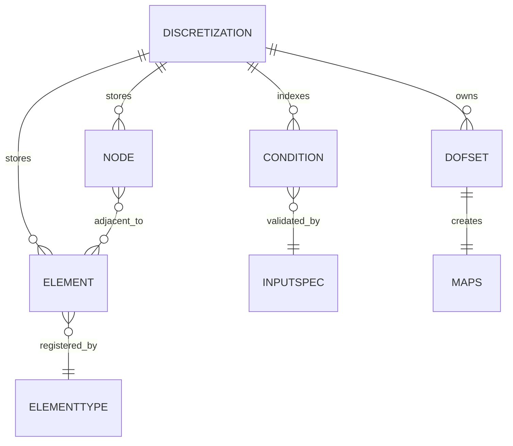

# FEM Discretization and deal.II Integration

`Core::FE::Discretization` is the central mesh-and-DOF object used by structural, fluid, scalar-transport, poro, contact, XFEM, reduced, and coupled simulations. It owns the relationship between nodes, elements, conditions, DOF sets, maps, and element evaluation.

## Data model

This entity model shows the runtime relationships maintained by `Core::FE::Discretization`.

`NodeRef` and `ElementRef` wrappers are lightweight non-owning references into a discretization. They provide stable access to coordinates, owners, local/global ids, adjacent elements, and the backing user node/element. Because they are references, they must not outlive the discretization or be used after redistributing and rebuilding internal storage.

## Fill-complete lifecycle

`fill_complete()` finalizes maps, DOFs, geometry, and boundary-condition structures. Its internal order is significant: it resets stale state, constructs row and column maps and local pointer vectors, connects element-to-node pointers, builds node-to-element adjacency, assigns DOFs when requested, initializes elements when requested, and builds boundary-condition geometry when requested. Helper logic such as `make_map_and_local_pointers` filters owned and ghosted entities into the correct maps and pointer arrays.

Many problem entrypoints rely on explicit fill ordering:

- structural dynamics fills the structure discretization before adapter setup;
- scalar transport fills fluid before scatra so fluid DOFs are lower than scatra DOFs;
- FSI with ALE fills structure, then fluid, then ALE so `structure dof < fluid dof < ale dof`;
- fluid-ALE fills fluid before ALE so `fluid dof < ale dof`;
- poro and poro-scatra setup functions clone and fill coupled discretizations before combined-system setup.

If a discretization is cloned, redistributed, or receives an additional DOF set, call `fill_complete()` again with the appropriate options before querying row/column maps or evaluating elements.

## Conditions and cloning

Conditions are validated input objects attached to nodes, lines, surfaces, volumes, or elements. They drive Dirichlet/Neumann data, contact/mortar interfaces, point coupling, transport conditions, heterogenous reactions, embedded mesh constraints, and result descriptions.

Cloning strategies copy topology and selected conditions from one discretization to another. Examples:

- ALE cloning creates ALE elements from fluid meshes when the ALE discretization is empty;
- scalar transport matching coupling clones scatra elements from fluid elements;
- poroelastic setup clones fluid/poro components from structure according to `CLONING MATERIAL MAP`;
- condition copy maps `TransportDirichlet` and transport Neumann conditions to generic Dirichlet/Neumann conditions for scatra-only runs.

Cloning must also update implementation type and material setup where the element module requires it.

## Element registration and evaluation

Element classes live in physics modules such as `solid_3D_ele`, `fluid_ele`, `scatra_ele`, `beam3`, `shell7p`, `w1`, `porofluid_pressure_based_ele`, and more. `src/global_legacy_module/4C_global_legacy_module.cpp` forces type registration for element types and material types. `Core::Elements::ElementDefinition` emits legacy element metadata through `emit_general_metadata`.

Element evaluation is driven by action strings and parameter lists. `Core::FE::Discretization::evaluate(params, strategy)` first enforces `filled()` and `have_dofs()` and throws if `fill_complete()` or DOF assignment was skipped. It creates a `Core::Elements::LocationArray` sized for all DOF sets, loops over column-owned elements, asks each element for its location vector including DOF ids, ownership, and stride data, resizes/zeros element matrices and vectors through `Core::FE::AssembleStrategy`, calls the element action, and then assembles each requested matrix/vector through the strategy. For example, ALE cloned elements are evaluated with `action = setup_material`; fluid and scatra elements choose calculation implementations from module-specific parameter and implementation types.

## Specialized discretizations

`Global::read_discretization` selects specialized discretization flavors:

- NURBS discretizations via `Core::FE::Nurbs` when spatial approximation is NURBS;
- XFEM discretizations through `src/xfem` and `src/fluid_xfluid` for cut/interface problems;
- HDG discretizations for fluid and scalar transport variants;
- face or xwall variants for selected fluid boundary behavior.

These variants still obey the same map and fill-complete contracts, but their element actions and topology creation differ.

## Optional deal.II integration

`src/deal_ii` is conditionally compiled only when `FOUR_C_WITH_DEAL_II` is enabled. Its canonical bridge is `DealiiWrappers::Context<dim, spacedim>` in `src/deal_ii/src/4C_deal_ii_context.hpp`.

The deal.II wrapper boundary is deliberately non-owning:

- `Context` references a `dealii::Triangulation` and a `Core::FE::Discretization`; both must outlive the context.
- Public construction is hidden; `create_triangulation(...)` builds a matching triangulation from a 4C discretization and creates the context.
- `to_element(cell)` converts a deal.II cell to the corresponding 4C element and throws if the cell is not locally owned.
- `is_locally_owned(cell)` is required for parallel 4C discretizations used with serial deal.II triangulations.
- `active_fe_indices_` maps active cells to entries in a `dealii::hp::FECollection`.
- `get_dof_indices_four_c_ordering(...)` exposes 4C local DOF ordering; helper functions can reorder to deal.II local ordering.

The module also owns triangulation, element conversion, FE values, mapping, sparsity, vector conversion, and linalg wrappers. `src/deal_ii/tests/4C_deal_ii_vector_mapping_test.np2.cpp` exercises vector conversion across the 4C/deal.II boundary.

## Focused tests

Important test areas:

- `src/core/fem/tests/discretization` for iterators and nodal coordinates, including MPI variants;
- `src/core/fem/tests/general` for element integration and interpolation;
- `src/core/fem/tests/geometry` for volumes and geometric utilities;
- element-family tests and benchmarks in the owning physics modules;
- `src/deal_ii/tests` when deal.II wrappers change.
