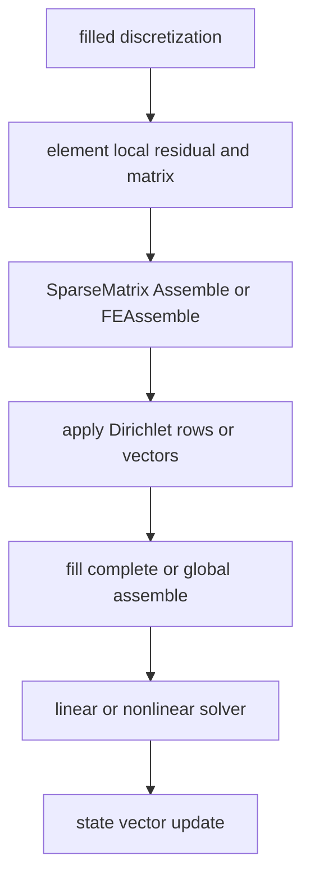

# Linear Algebra and Solvers

4C wraps Trilinos/Epetra linear algebra in `src/core/linalg`, linear solver configuration in `src/core/linear_solver`, and NOX nonlinear integration in `src/solver_nonlin_nox`. These layers connect FEM assembly from [FEM Discretization](fem-discretization.md) to physics algorithms.

## Core linear algebra objects

| Object family | Role |
| --- | --- |
| `Core::LinAlg::Map` and map extractors | Own row, column, domain, range, block, and multi-field index spaces. Coupling code depends on precise map layouts. |
| `Vector` and `MultiVector` | Distributed field, residual, update, and state vectors. |
| `SparseOperator` and `SparseMatrix` | Sparse Jacobians, system matrices, projection matrices, and coupling matrices. |
| Dense matrices/tensors | Element-local calculations, material laws, tensor operations, and utility tests. |
| FE vectors/matrices | Assembly-aware wrappers for finite-element contributions. |

`SparseMatrix` wraps `Epetra_CrsMatrix` or `Epetra_FECrsMatrix`. Its key FE-specific operations include assembling element matrices, applying Dirichlet constraints, zeroing, resetting, and global assembly of nonlocal values. Constructor flags control whether Dirichlet rows modify graph structure and whether the original graph is saved for faster repeated assembly.

Important invariant: a matrix view shares internal Epetra data. Use deep copy when both matrices must live independently; use view only for temporary ownership transfer or intentional shared access.

## FE assembly lifecycle

This lifecycle shows where map and graph state must be valid.

Use `FE_MATRIX` when nonlocal element contributions are expected; its `GlobalAssemble` distributes values to owning ranks before completion. Use CRS matrices for standard row-owned assembly. Sparse assembly checks local matrix/vector dimensions against location arrays, skips rows owned by other ranks, verifies the target row map owns each global row, rejects assembly into an already filled sparse matrix, and throws when a vector or target map lacks the requested global id. Dirichlet helpers also require unique maps where documented and validate that prescribed-value and solution maps contain the constrained ids.

## Linear solver layer

`src/core/linear_solver` owns method and preconditioner configuration:

- direct and iterative methods under `method`;
- preconditioners for Ifpack, MueLu, Teko, and projection strategies;
- AMGnxn support objects;
- Thyra utility adapters;
- parameter parsing for solver sections.

Physics modules usually request solver parameters from `Global::Problem::instance()->solver_params(id)` and create `Core::LinAlg::Solver` with a communicator and verbosity setting. Reduced lung is a clear example: it builds row/domain/column maps, creates a `SparseMatrix`, and constructs a solver from its configured linear solver id.

## NOX nonlinear integration

`src/solver_nonlin_nox` wraps NOX concepts behind 4C-specific interfaces:

- `NOX::Nln::Problem` owns global NOX data, the solution vector, the Jacobian/preconditioner operator, and creates linear systems, groups, and status tests;
- `Linearsystem` classes bridge 4C sparse operators to NOX solves;
- direction, line search, merit function, status-test, scaling, vector, group, and solver factories select behavior from input parameters;
- constraint/contact/cardiovascular integrations provide specialized interfaces and linearsystems.

`Problem::initialize(...)` must run before creating groups or status tests; otherwise `check_init()` throws. Final NOX status is checked explicitly so nonlinear failures surface as `Core::Exception` and propagate to the executable catch block.

## Coupling matrices

Coupling and mortar systems depend heavily on map correctness:

- matching interface coupling creates permuted master/slave DOF maps so data can be copied into the other side's layout;
- mortar coupling owns `D`, `Dinv`, `M`, and `P` projection matrices;
- volumetric mortar owns `p12_` and `p21_` projection matrices;
- contact managers add Lagrange multiplier DOFs above existing displacement DOFs.

These usages are documented in [Coupled Multiphysics](../physics/coupled-multiphysics.md) and [Contact, Constraints, and Geometry Pairing](../physics/contact-constraints-geometry.md).

## Tests

`src/core/linalg/tests` includes tensor, map, vector, sparse algebra, dense matrix, determinant, inverse, SVD, eigen, interpolation, and MPI assembly tests. Solver behavior is also validated indirectly through physics regressions because nonlinear and linear convergence are field-level properties.
