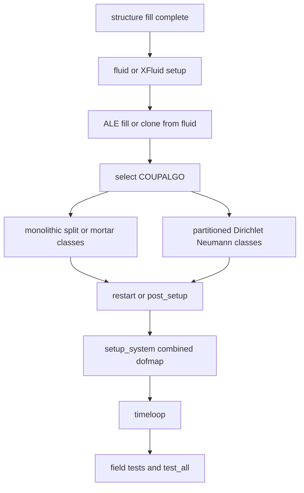

# Coupled Multiphysics and Coupling Infrastructure

Coupled problems use two layers: problem orchestration modules such as `fsi`, `fpsi`, `fs3i`, `ssi`, `poroelast_scatra`, `tsi`, and `pasi`, and generic coupling infrastructure in `src/coupling`, `src/adapter`, `src/mortar`, and `src/contact`. Core map rules are documented in [Linear Algebra and Solvers](../core/linalg-solvers.md).

## FSI with ALE lifecycle

`fsi_ale_drt()` in `src/fsi/src/4C_fsi_dyn.cpp` is the clearest complete coupled workflow:

1. get and fill the structure discretization, with special binning redistribution for `PointCoupling` conditions;
2. set up the fluid discretization, using XFluid setup when configured;
3. fill ALE and clone ALE from fluid if the ALE mesh is absent;
4. enforce disjoint fluid/ALE node ids for explicit ALE meshes;
5. optionally rebalance structure, fluid, and ALE when matching-grid assumptions are false;
6. inspect `fsi_dynamic_params().COUPALGO`;
7. construct a monolithic or partitioned FSI algorithm class;
8. read restart or call `post_setup()`;
9. call `setup_system()` to build combined DOF maps and coupled matrices;
10. run `timeloop(...)`;
11. calculate errors, let field algorithms write their scheduled output during the time loop, and add field tests for ALE, fluid, and structure. FSI does not use the structural `WRITE_INITIAL_STATE`/`WRITE_FINAL_STATE` branch directly; output is owned by the selected FSI field algorithms and their output-control configuration after `post_setup()` or `read_restart()`.

This flow shows the coupled-system setup order shared by other multiphysics modules.

## Problem orchestration modules

Problem-type restrictions are not only in `entrypoint_switch`. `Adapter::FluidBaseAlgorithm` contains `Core::ProblemType`-dependent fluid algorithm construction and coupling behavior for pure fluid, FSI, poro, scalar, and reduced variants. `Adapter::AleBaseAlgorithm` branches ALE setup for pure ALE, FSI, FSI redmodels, FpSI, XFEM, and fluid-ALE problem types. Poro and pressure-based modules add their own factories: `PoroElast::Utils::create_poro_algorithm`, porofluid pressure-based dynamic entrypoints, artery-coupling strategy classes, and porofluid element phase/variable managers. When changing coupled behavior, inspect both the problem entrypoint and adapter/factory code used by that problem type.

| Module | Coupled role |
| --- | --- |
| `adapter` | Field adapters/wrappers for structure, fluid, ALE, scatra, porofluid, and coupled variants. It is highly central and depends on most physics modules. |
| `fsi` | Fluid-structure interaction with ALE, monolithic and partitioned algorithms, mortar/sliding/fluid-fluid variants, NOX nonlinear solvers. |
| `fsi_xfem` | XFEM-based FSI managers and monolithic coupling over XFluid/XFEM state. |
| `fpsi`, `fs3i` | Fluid-poro-scatra and fluid-structure-scatra interactions, including biofilm and gas/thermo FSI variants. |
| `ehl` | Elastohydrodynamic lubrication, monolithic and partitioned variants. |
| `ssi`, `ssti`, `sti`, `tsi` | Scalar-structure, scalar-structure-thermo, scalar-thermo, and thermo-structure interactions. |
| `pasi` | Particle-structure interaction with one-way and two-way partitioned coupling. |
| `fbi` | Fluid-beam interaction through immersed/moving boundary wrappers. |
| `poroelast_scatra`, pressure-based porofluid coupled variants | Porous, elastic, scalar, and artery-coupled systems documented with poro models. |

## Matching interface coupling

`Coupling::Adapter::Coupling` in `src/coupling/src/adapter/4C_coupling_adapter.hpp` manages transfers between matching sets of nodes from two discretizations. It builds master and slave DOF maps and permuted maps so vectors can be copied into the other field's layout. Setup modes include:

- condition-based coupling via condition maps and condition names;
- explicit master/slave node vectors or maps;
- fixed `numdof` coupling or explicit per-side DOF lists;
- cloned-discretization shortcuts when node or DOF ids are already aligned.

Invariant: slave nodes must find a match unless the selected setup says otherwise; master nodes may be a superset. Tolerance selection for octree matching must be large enough to find true matches but not so large that unrelated geometry becomes ambiguous.

## Mortar interface coupling

`Coupling::Adapter::CouplingMortar` couples nonmatching interface meshes. It delegates geometric and projection work to `Mortar::Interface`, computes coupling matrices `D` and `M`, and exposes `D`, `Dinv`, `M`, and projection `P`. Transfer formulas are:

- master to slave: primal variables projected through `D^{-1} M`;
- slave to master: dual variables projected through `M^T D^{-T}`.

Setup takes master/slave/ALE discretizations, coupled DOFs, coupling condition names, communicator, function manager, binning parameters, discretization map, output control, spatial approximation type, and flags for slave-with-ALE or sliding-ALE cases. This makes it a shared infrastructure for FSI, sliding ALE, fluid mesh tying, and fluid/scatra mesh tying.

## Volumetric mortar

`Coupling::VolMortar::VolMortarCoupl` in `src/coupling/src/volmortar/4C_coupling_volmortar.hpp` glues nonmatching volume meshes for displacement, temperature, or other fields. It expects both discretizations to be filled and, by default, at least two DOF sets so the first DOF set of one side can couple with the second of the other. It supports:

- integration types `inttype_segments` and `inttype_elements`;
- cut procedures `cuttype_directdivergence` and `cuttype_tessellation`;
- coupling types `couplingtype_volmortar` and `couplingtype_coninter`;
- dual or standard shape functions;
- projection matrices `p12_` and `p21_`;
- optional material strategy for assignment.

`src/inpar/4C_inpar_volmortar.cpp` exposes these as the `VOLMORTAR COUPLING` input group. Volumetric mortar depends on FEM, linalg, cut, mortar, and geometric search. It is required for nonmatching scalar/fluid coupling and thermo-structure style transfers.

## Change recipe for coupling modes

When adding a coupling mode, update the input enum/spec in `src/inpar`, implement the map/projection setup in `src/coupling` or the problem module, document fill-complete and DOF-set order, add or update result/regression tests that exercise transfer in both directions, and verify with a minimal coupled input. Never assume row/column maps from a pre-redistribution discretization remain valid after binning or cloning.
