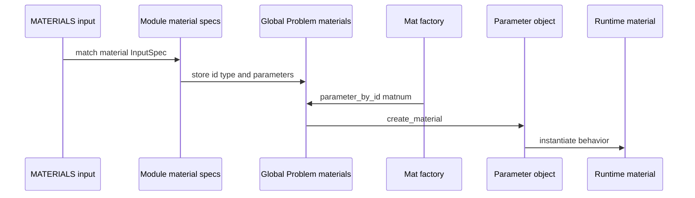

# Materials, Mixtures, and Constitutive Laws

Material behavior is centered in `src/mat`, supported by `src/mixture`, `src/contact_constitutivelaw`, `src/core/material`, and legacy material enums. Materials are part of the global input schema and are created on demand through `Mat::factory(int matnum)`.

## Runtime creation path

This sequence shows why input spec, enum type, parameter object, and material object must be kept in sync.

`Mat::factory(int matnum)` retrieves the material list from the current `Global::Problem` instance, checks that it exists and is non-empty, fetches the parameter object by id, and calls `create_material()`. `Mat::make_parameter(...)` switches on `Core::Materials::MaterialType` and creates the corresponding `Core::Mat::PAR::Parameter` subclass with id, type, and validated input data.

## Material families

`src/mat` contains many families. Important groups are:

- fluid laws: Newtonian, Murnaghan-Tait, weakly compressible, density/viscosity, Herschel-Bulkley, Carreau-Yasuda, Sutherland;
- structural solids: St. Venant-Kirchhoff, hyperelastic, anisotropic, viscoelastic, plastic, thermoplastic, Robinson, SMA, damage, growth/remodel;
- biological/cardiac: myocard variants, muscle laws, AAA neo-Hooke, Maxwell acinus;
- scalar/electrochemical: scatra, scatra reaction, Soret, Newman, electrode, ion, electrochemical phase/material;
- poro and multiphase: fluid-poro, single/multiphase poro laws, permeability/viscosity/density laws, struct-poro and reactions;
- particle: DEM, PD, SPH fluid/boundary/wall materials;
- beam/membrane/shell specific materials;
- list and interpolation materials for grouped/reaction behavior.

The factory file includes all concrete headers; this is a sign that adding a user-facing material is a global extension, not a private class addition.

## Mixture module

`src/mixture` depends on `mat`, `global_data`, and `inpar`. It provides constituents, growth strategies, prestress strategies, and mixture rules used by complex solid and biological material models. Factory registration pulls mixture constituents into material construction through `4C_mat_material_factory.cpp` includes such as `4C_mixture_constituent_*`, growth strategy headers, prestress strategy headers, and rule headers.

## Contact constitutive laws

`src/contact_constitutivelaw` provides constitutive law input and runtime behavior for contact interfaces. `Global::set_up_input_file` explicitly adds a `CONTACT CONSTITUTIVE LAWS` list section using `CONTACT::CONSTITUTIVELAW::valid_contact_constitutive_laws()`. Contact managers can reference law ids through condition parameters, especially for multiscale contact.

## Invariants

- Every material input entry must carry a `MAT` id and material type.
- The material enum, input spec, parameter constructor, runtime material, and legacy registration must agree.
- Materials accessed from cloned elements must exist in the cloning material map and target problem material list.
- Element implementations own how and when material objects are requested; material code should not assume a specific element family.
- Materials that store history or communicate state must participate in pack/unpack and ParObject registration if relevant.

## Tests

Focused material tests live under `/unittests/mat` and source-module tests. IO tests also depend on material definitions for concrete schema behavior. Material changes should run the material unit tests and at least one representative physics regression that exercises the law through an element.
