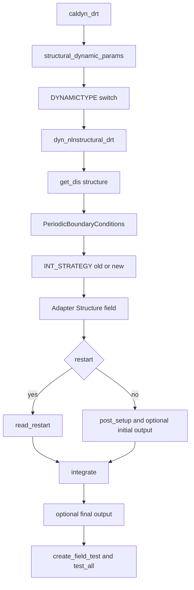

# Structure and Solid Elements

Structural simulation starts at `caldyn_drt()` in `src/structure/4C_structure_dyn_nln_drt.cpp`. Element behavior is distributed across `solid_3D_ele`, `solid_poro_3D_ele`, `solid_scatra_3D_ele`, `beam3`, `beaminteraction`, `shell7p`, `shell_kl_nurbs`, `truss3`, `torsion3`, `w1`, `membrane`, `bele`, `rigidsphere`, and related material modules.

## Structural runtime flow

This flow shows the ordering used by structural dynamics.

## Adapter split

`dyn_nlnstructural_drt()` selects implementation strategy from `INT_STRATEGY`:

- `Inpar::Solid::int_old` constructs `Adapter::StructureBaseAlgorithm`, obtains `structure_field()`, and calls `setup()`;
- other strategies use `Adapter::build_structure_algorithm(sdyn)`, call `init(...)`, `setup()`, and then obtain `structure_field()`.

The comment identifies the old/new split as temporary cleanup infrastructure. Any structural change must check which adapter path it affects.

## Element module groups

| Module group | Responsibility |
| --- | --- |
| `solid_3D_ele` | 3D solid elements, displacement-based formulations, EAS, F-bar, MULF, shell ANS helpers, Neumann evaluators, nullspace and properties. |
| `solid_poro_3D_ele` | Poro solid elements with pressure-based and pressure-velocity formulations, P1 variants, Nitsche helpers. |
| `solid_scatra_3D_ele` | Coupled solid-scalar transport elements. |
| `beam3`, `truss3`, `torsion3`, `rigidsphere` | 1D/rigid structural element families with element input/evaluation and structure_new integration. |
| `shell7p`, `shell_kl_nurbs`, `membrane`, `w1`, `bele` | Shell, membrane, wall, and boundary/volume element families. |
| `beaminteraction` | Beam-to-beam/beam-to-solid interaction model evaluators and geometry-pair access. |
| `structure_new` | New structure model evaluators, functions, result tests, and adapter integration. |
| `stru_multi`, `browniandyn`, `cardiovascular0d` integrations | Specialized structure-coupled evaluators. |

Element factories and legacy type registration are covered in [Module Registration](../extension/module-registration.md); material laws are covered in [Materials](materials.md).

## Lifecycle invariants

- Periodic boundary conditions are applied before adapter construction when present.
- Restart skips `post_setup()` but must still set vectors and variables before integration.
- Initial output is written only for non-restart runs and only when `WRITE_INITIAL_STATE` is true.
- Final output is forced when `WRITE_FINAL_STATE` is true.
- Field tests are registered after integration and before `test_all`.
- FSI and coupled pages rely on structure DOF ordering, so changing structural fill or DOF assignment can break coupled problems.

## Validation

Focused checks include `/unittests/solid_3D_ele`, source element tests and benchmarks under `src/solid_3D_ele`, and representative structural input files under `/tests/input_files`. For changes touching beam/contact/coupling, also run tests linked from [Contact, Constraints, and Geometry Pairing](contact-constraints-geometry.md) and [Coupled Multiphysics](coupled-multiphysics.md).
