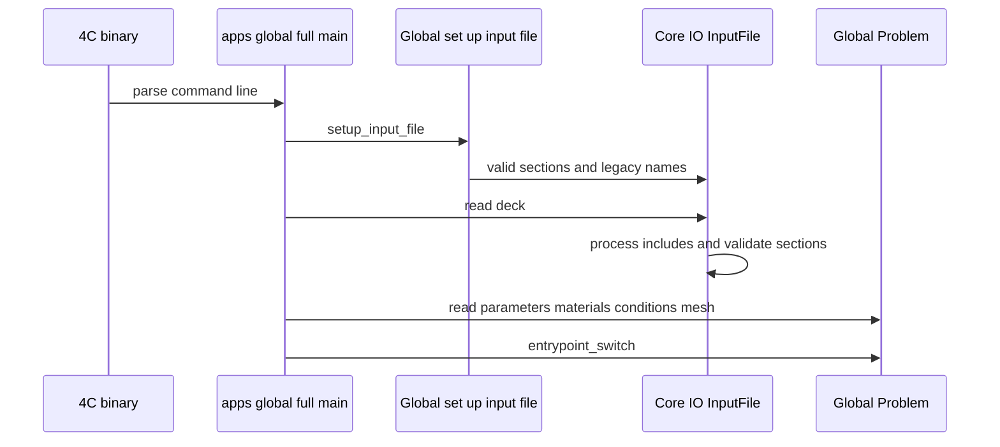

# Input registry architecture

This page is for agents changing the input format. User-facing deck behavior is documented in [4C input file format](../input/file-format.md); this page maps that behavior to source.

## Runtime flow



This sequence is supported by `apps/global_full/4C_global_full_main.cpp`, `apps/global_full/4C_global_full_io.cpp`, and `src/global_data/4C_global_data_read.cpp`.

## Registration layers

`Global::set_up_input_file` first gathers non-module lists: `CONTACT CONSTITUTIVE LAWS`, `CLONING MATERIAL MAP`, `RESULT DESCRIPTION`, `MATERIALS`, special `FUNCT<n>` function sections, and all condition definitions. Only after that does it append ordinary module parameter sections from `Global::valid_parameters()`. Legacy string sections such as `NODE COORDS` and `STRUCTURE ELEMENTS` are passed separately to `InputFile`, so they are retrieved as raw dat-style strings rather than matched as typed YAML maps.

## Core files

| Change intent | Source anchor | Tests/evidence |
|---|---|---|
| Add or change a top-level parameter group | `src/global_legacy_module/4C_global_legacy_module_validparameters.cpp` or module `*_input.cpp` | A minimal `tests/input_files/*.4C.yaml` using the key; parser unit tests if changing generic behavior. |
| Change parser include/root/duplicate behavior | `src/core/io/src/4C_io_input_file.cpp` | `src/core/io/tests/4C_io_input_file_test.cpp`. |
| Change supported typed input semantics | `src/core/io/src/4C_io_input_types.hpp`, `4C_io_input_spec_builders.*`, `4C_io_input_spec.*` | `src/core/io/tests/4C_io_input_spec_test.cpp`, validators tests. |
| Change result checking syntax | `global_legacy_module_callbacks().valid_result_description_lines()` registered in `src/global_data/4C_global_data_read.cpp` as `RESULT DESCRIPTION` | Existing benchmark decks with `RESULT DESCRIPTION` entries. |
| Add material selector | `src/global_legacy_module/4C_global_legacy_module_validmaterials.cpp` plus material implementation under `src/mat` or module | A deck under `tests/input_files/mat_*` or relevant physics family. |
| Add condition selector | `src/global_legacy_module/4C_global_legacy_module_validconditions.cpp` or module-specific `set_valid_conditions` | A deck with `DESIGN ... CONDITIONS` and topology. |
| Add linear solver parameter | `src/core/linear_solver/src/method/4C_linear_solver_method_input.cpp` | Solver-focused input deck or unit tests. |
| Add element-line grammar | Element module's `setup_element_definition` using `InputSpecBuilders`; registry via `Core::Elements::ElementDefinition` | Element tests and representative input deck. |
| Add contact law | `src/contact_constitutivelaw/src/4C_contact_constitutivelaw_valid_laws.cpp` | Contact/multiscale deck with `CONTACT CONSTITUTIVE LAWS`. |

## Metadata emission

Running the binary with `-p` or `--parameters` emits YAML metadata for the general and user input specs. `apps/global_full/4C_global_full_main.cpp` calls `emit_general_metadata(root_ref)` and `input_file.emit_metadata(root_ref)`. Use this when available to audit accepted keys, defaults, and enum values after a build.

```bash
./4C --parameters > input-metadata.yaml
```

Do not hand-maintain generated metadata in the wiki; source specs are authoritative.

## Adding a parameter safely

1. Add the `parameter<T>`, `selection<T>`, or `deprecated_selection<T>` in the owning module's `valid_parameters()`.
2. Decide whether the key is required, defaulted, or optional. Required keys in a commonly used group can break existing decks.
3. Use enum selectors for finite choices and document exact strings.
4. Update a focused input deck in `tests/input_files` or add a new one.
5. If parser semantics changed, update `src/core/io/tests`.
6. Update the relevant wiki reference page so agents do not invent keys.

## Invariants

- Top-level section names must be unique when registered.
- `INCLUDES` and `input_version` are reserved by `InputFile`.
- Unknown keys in typed sections are parse errors.
- Slash-named sections are top-level keys, not nested YAML maps.
- Legacy sections are string fragments parsed by downstream readers, not typed YAML maps.
