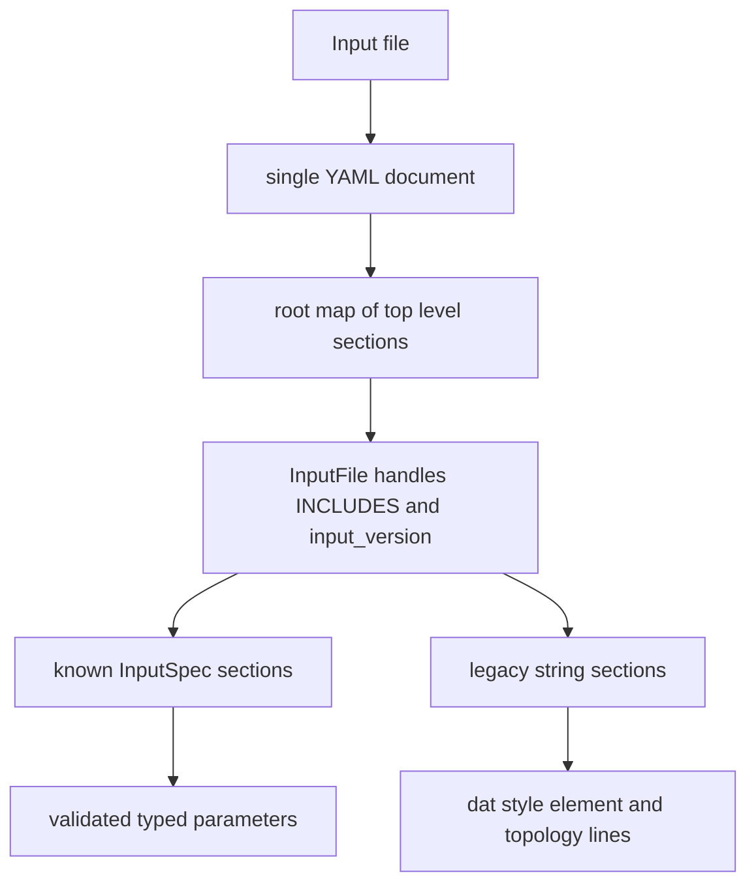

# 4C input file format

4C reads a YAML or JSON input deck through `Core::IO::InputFile`, which is assembled by `Global::set_up_input_file` in `src/global_data/4C_global_data_read.cpp`. The normal binary invocation is:

```bash
./4C <input_file>.4C.yaml <output_basename>
```

The source documentation shows the same form and states that the input file commonly has suffix `.4C.yaml`; the parser itself accepts only `.yaml`, `.yml`, and `.json` extensions. JSON works because JSON is valid YAML for the YAML parser.

## Root shape and top-level sections

A deck must contain exactly one YAML document, and that document must be a mapping. Every simulation concept is a top-level mapping key, even when the key contains slashes:

```yaml
TITLE:
  - "short human description"
PROBLEM TYPE:
  PROBLEMTYPE: "Fluid"
FLUID DYNAMIC:
  PHYSICAL_TYPE: "Stokes"
FLUID DYNAMIC/NONLINEAR SOLVER TOLERANCES:
  TOL_VEL_RES: 1e-09
SOLVER 1:
  SOLVER: "UMFPACK"
```

`FLUID DYNAMIC/NONLINEAR SOLVER TOLERANCES` is not nested under `FLUID DYNAMIC`; it is a literal top-level key. The same rule applies to `STRUCTURAL DYNAMIC/GENALPHA`, `PARTICLE DYNAMIC/SPH`, and all other slash-named sections.



This diagram shows the parser path from a deck file into typed `InputSpec` sections and legacy string sections.

## Reserved keys: `INCLUDES` and `input_version`

`INCLUDES` and `input_version` are registered by `InputFile` itself, not by a physics module.

| Key | Type | Required | Behavior |
|---|---:|---:|---|
| `INCLUDES` | optional list of paths | no | Paths to additional `.yaml`, `.yml`, or `.json` files. A relative path is resolved relative to the file that contains the include. The parser reads includes before normal section validation, removes `INCLUDES` from the merged tree, and rejects include cycles or including the same file twice. |
| `input_version` | optional string matching `major.minor.patch` | no | Matched after include/section parsing. If present and equal to `VersionControl::input_version`, rank 0 prints `Compatible input file version ... detected.` If present and different, rank 0 prints `Warning: version mismatch: The input file requires input version ..., but the input version of 4C is ... Your input file may be incompatible with 4C.` The mismatch is a warning, not an immediate parse abort. Null or omission prints no version message. |

Example split deck:

```yaml
INCLUDES:
  - materials.4C.yaml
  - geometry.4C.yaml
PROBLEM TYPE:
  PROBLEMTYPE: "Structure"
STRUCTURAL DYNAMIC:
  DYNAMICTYPE: "Statics"
  LINEAR_SOLVER: 1
SOLVER 1:
  SOLVER: "UMFPACK"
```

A top-level section may be defined only once across the top-level file and all includes. If both files define `MATERIALS`, parsing fails with a duplicate-section error.

## Required vs optional in practice

The authoritative required/optional/default behavior is encoded by `InputSpec` builders:

- A top-level group with `.required = true` must be present. `PROBLEM TYPE` is required.
- A top-level group with `.required = false` may be omitted. Most physics-control sections are optional to the generic parser, but are semantically required by the selected `PROBLEMTYPE` at run time. If an optional group is present, its required children are enforced.
- A parameter with no default and no `std::optional` wrapper is required when its containing group/list item is matched. Example: `SOLVER` inside a `SOLVER n` section is required.
- A parameter with `.default_value = ...` may be omitted; the default is stored in the parameter container.
- A `std::optional<T>` parameter may be omitted and has no value.
- A `selection` is written as exactly one enum-keyed child group under the selection key; the selected key is stored internally as the selector.
- A `one_of` alternative means exactly one of the listed required alternatives may match. This is how material selector groups work: one `MAT_*` group per material item.
- Unknown keys in a non-legacy section are rejected. Unknown top-level section names are also rejected unless they are special `FUNCT<n>` sections or registered legacy string sections.
- YAML scalar types are strict: a quoted numeric or boolean value is a YAML string and does not match an `int`, `double`, or `bool` parameter. Quote enum and string values; do not quote numbers or booleans that must parse as numbers/booleans.
- `std::filesystem::path` parameters store paths as path values. Section-specific readers resolve relative paths according to the owning file or documented input-file context, as `INCLUDES` does for included files.
- `input_version` must be null or match `major.minor.patch`; when it is present but incompatible with the compiled input version, 4C uses it to warn about input compatibility before normal simulation setup.

`InputSpec` metadata emitted by `./4C --parameters` contains the same contract in machine-readable form: each spec records its name, type, whether it is required, choices for enum selections or `one_of` alternatives, default values when present, and size constraints for vectors whose length depends on another parameter.

The supported scalar/container types come from `src/core/io/src/4C_io_input_types.hpp`: `int`, `double`, `bool`, `std::string`, `std::filesystem::path`, enums, `std::optional<T>`, `std::vector<T>`, `std::array<T,n>`, `std::map<std::string,T>`, tuples, pairs, and tensor proxy types.

## Core top-level section families

| Section family | YAML shape | Required by parser | Canonical page |
|---|---|---:|---|
| `TITLE` | sequence or value used as description | no | this page |
| `PROBLEM TYPE` | map | yes | [Problem types](problem-types.md) |
| `PROBLEM SIZE`, `DISCRETISATION`, `IO` | map | no | [Common sections](../reference/common-sections.md) |
| `<FIELD> DOMAIN` | map | no | [Geometry and elements](../reference/geometry-and-elements.md) |
| `<FIELD> GEOMETRY` | map with external mesh file and element blocks | no | [Geometry and elements](../reference/geometry-and-elements.md) |
| `SOLVER 1` ... `SOLVER 9` | map | no until referenced | [Solvers](../reference/solvers.md) |
| `MATERIALS` | sequence of material entries | no until elements reference materials | [Materials](../reference/materials.md) |
| `CONTACT CONSTITUTIVE LAWS` | sequence of contact law entries | no until contact law ids are used | [Materials](../reference/materials.md#contact-constitutive-laws) |
| `DESIGN ... CONDITIONS` | sequence of condition entries | no until topology/physics needs them | [Conditions](../reference/conditions.md) |
| `FUNCT1`, `FUNCT2`, ... | sequence of function definitions | no until a `FUNCT` or function id refers to them | [Conditions](../reference/conditions.md#functions-and-time-dependence) |
| Legacy topology and element sections | sequence of strings | no | [Geometry and elements](../reference/geometry-and-elements.md#legacy-topology-and-element-sections) |

## Lists and selector groups

`MATERIALS`, `CONTACT CONSTITUTIVE LAWS`, many condition sections, and `RESULT DESCRIPTION` are YAML sequences. A material item has a required integer `MAT` and exactly one material selector group:

```yaml
MATERIALS:
  - MAT: 1
    MAT_fluid:
      DYNVISCOSITY: 1.0
      DENSITY: 1.0
```

The selector name is part of validation. Using `MAT_Fluid` instead of `MAT_fluid`, or omitting a required key such as `DYNVISCOSITY`, fails before the solver starts.

Conditions similarly use a geometric entity id key, normally `E`, plus condition-specific parameters:

```yaml
DESIGN SURF DIRICH CONDITIONS:
  - E: 1
    NUMDOF: 4
    ONOFF: [1, 1, 1, 0]
    VAL: [1, 0, 0, 0]
    FUNCT: [0, 0, 0, 0]
```

## Minimal deck checklist

For a first-attempt accepted deck, provide at least:

1. `PROBLEM TYPE` with accepted `PROBLEMTYPE` spelling.
2. The dynamic section for that problem type, with `LINEAR_SOLVER` set when a linear solve is required.
3. `SOLVER n` for every positive solver id referenced by a dynamic section.
4. A mesh, either generated by `<FIELD> DOMAIN`, external by `<FIELD> GEOMETRY`, or legacy `NODE COORDS` plus `<FIELD> ELEMENTS` plus topology sections.
5. `MATERIALS` entries for every `MAT` id used by elements or particles.
6. Boundary/initial conditions required by the mathematical problem.
7. Function sections for every nonzero function id referenced by `FUNCT`, `STARTFUNCNO`, `VELFUNCNO`, or similar keys.
