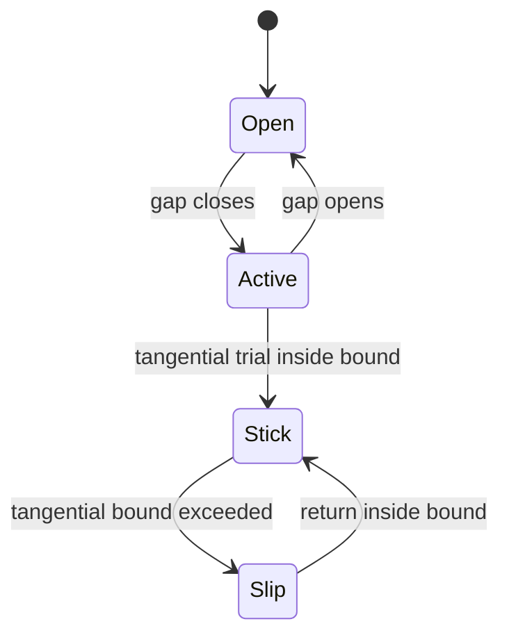

# Contact and mesh-tying theory and input controls

Contact input is centered on [CONTACT DYNAMIC](../reference/contact-dynamic.md), contact/meshtying condition sections, structural mechanics, and optional `CONTACT CONSTITUTIVE LAWS`. Source entrypoints include `src/contact/src/4C_contact_input.cpp`, `src/contact`, `src/mortar`, and `src/contact_constitutivelaw`.

## Constraint model

For two bodies or surfaces, contact enforces a non-penetration inequality in the normal gap \(g_n\):

\[
g_n \ge 0, \quad \lambda_n \ge 0, \quad \lambda_n g_n = 0.
\]

Here \(\lambda_n\) is the normal contact pressure or multiplier. Tangential behavior depends on `FRICTION`:

- `None`: normal contact only.
- `Stick`: tangential sticking constraint.
- `Tresca`: tangential traction bounded by a prescribed threshold.
- `Coulomb`: tangential bound scales with normal contact pressure.

Mesh-tying is equality-style constraint transfer between nonmatching interfaces; it shares mortar and constraint-system machinery with contact but has no unilateral active-set inequality.

## Discrete enforcement strategies

| `STRATEGY` | Mathematical meaning | Key inputs |
|---|---|---|
| `LagrangianMultipliers`, `lagrange`, `Lagrange` | Add multiplier dofs and saddle-point or condensed system enforcing constraints exactly in weak form. | `SYSTEM`, structural solver settings, contact conditions. |
| `penalty`, `Penalty` | Replace multiplier by penalty traction \(\lambda_n \approx \epsilon g_n^-\). Easier system, approximate constraint. | `PENALTYPARAM`. |
| `Uzawa` | Iteratively updates multipliers for constrained problem. | `UZAWAMAXSTEPS`, `UZAWACONSTRTOL`, structural `UZAWA*` keys. |
| `Nitsche` | Weakly enforces constraints with consistent and penalty-like terms. | Nitsche-specific contact examples and conditions. |
| `MultiScale` | Contact response can be supplied by constitutive law/surrogate/micro model. | `CONTACT CONSTITUTIVE LAWS`, `CoConstLaw_*` entries. |

`SYSTEM` controls condensed vs saddle-point algebra. Condensation removes multiplier unknowns into an effective primal system; saddle-point keeps block structure and needs a compatible linear solver/preconditioner.

## Nonlinear solution

Contact is nonsmooth because active sets, gap sign, and friction stick/slip states change. `SEMI_SMOOTH_NEWTON` enables semi-smooth Newton handling; `SEMI_SMOOTH_CN` and `SEMI_SMOOTH_CT` scale normal/tangential terms. `NORMCOMBI_RESFCONTCONSTR` combines structural residual and contact-constraint checks.

This state diagram summarizes contact active-set and friction transitions controlled by contact strategy and friction inputs.

## Coupling to structure

Contact forces enter the structural residual described in [Structural theory](structural.md). Therefore a contact deck also needs structural materials, structural elements, and structural dynamic controls. `LINEAR_SOLVER` ids in both structural and contact sections must point to configured [Solvers](../reference/solvers.md).

## Contact laws

`CONTACT CONSTITUTIVE LAWS` defines law ids separate from `MATERIALS`. `CoConstLaw_linear`, `CoConstLaw_power`, `CoConstLaw_cubic`, broken-rational, Python surrogate, and micro laws provide force-gap or pressure-gap behavior. See [Materials and contact constitutive laws](../reference/materials.md#contact-constitutive-laws).
