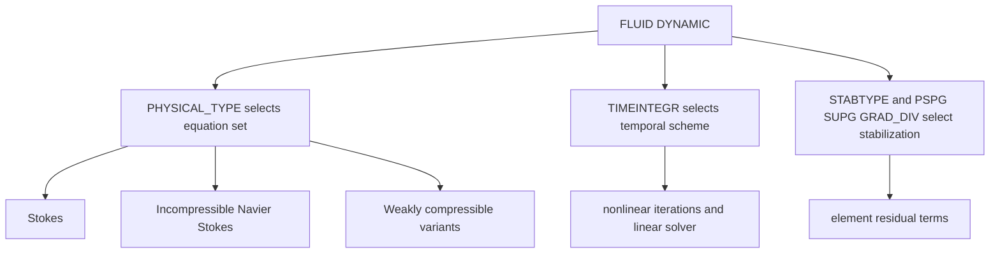

# Fluid mechanics theory and input controls

Fluid decks configure the equations through [FLUID DYNAMIC](../reference/fluid-dynamic.md), fluid element definitions, materials, and boundary conditions. The input registry is `src/inpar/4C_inpar_fluid.cpp`; fluid element definitions and formulations are under `src/fluid_ele`, `src/fluid`, `src/fluid_turbulence`, and `src/fluid_xfluid`.

## Governing equations by `PHYSICAL_TYPE`

For incompressible flow, 4C solves the Navier-Stokes system for velocity \(\mathbf u\) and pressure \(p\):

\[
\rho(\partial_t \mathbf u + \mathbf u\cdot\nabla \mathbf u) - \nabla\cdot(2\mu\boldsymbol\varepsilon(\mathbf u)) + \nabla p = \rho\mathbf b,
\]

\[
\nabla\cdot\mathbf u = 0.
\]

`PHYSICAL_TYPE: "Stokes"` removes the nonlinear convective term. `Oseen` uses a prescribed advective field, controlled by `OSEENFIELDFUNCNO`. Weakly compressible variants add density/pressure equation-of-state behavior and use weakly compressible material parameters such as `MAT_fluid_murnaghantait` or `MAT_fluid_weakly_compressible`.

## Spatial discretization and stabilization

The velocity and pressure are approximated by finite-element spaces. Equal-order or otherwise non-inf-sup-stable spaces need stabilization. The residual-based stabilization subsection provides:

- `PSPG` for pressure stabilization.
- `SUPG` for streamline-upwind stabilization of advection.
- `GRAD_DIV` for incompressibility/divergence control.
- `STABTYPE` to select no, residual-based, edge-based, or pressure-projection stabilization.
- `DEFINITION_TAU`, `CHARELELENGTH_U`, and `CHARELELENGTH_PC` to choose stabilization parameter definitions and element length scales.

In weak residual form, stabilization adds element-wise terms weighted by \(\tau\) and residuals of momentum and continuity equations. Edge-based stabilization adds facet/edge jump penalties and is used by selected XFEM and edge-stabilized examples.

This diagram maps high-level fluid inputs to equation, stabilization, and solve choices.

## Time integration

`TIMEINTEGR` controls temporal discretization:

| `TIMEINTEGR` | Role | Important keys |
|---|---|---|
| `Stationary` | Solves steady Stokes/Navier-Stokes residual. | `ITEMAX`, nonlinear tolerances. |
| `One_Step_Theta` | One-step theta transient scheme. | `TIMESTEP`, `THETA`, `START_THETA`, `NEW_OST`. |
| `BDF2` | Second-order backward differentiation. | `TIMESTEP`, starting scheme controls. |
| `Np_Gen_Alpha` | Generalized-alpha style with pressure treatment. | `ALPHA_M`, `ALPHA_F`, `GAMMA`. |
| `Af_Gen_Alpha` | Alternative generalized-alpha formulation. | `ALPHA_M`, `ALPHA_F`, `GAMMA`. |

`NUMSTEP`, `MAXTIME`, `RESULTSEVERY`, and `RESTARTEVERY` control the time loop and output cadence. `FLUID DYNAMIC/TIMEADAPTIVITY` can adjust time step using a CFL-like estimator.

At runtime, `Adapter::FluidBaseAlgorithm` consumes the parsed `FLUID DYNAMIC` parameter list and transfers `TIMEINTEGR`, `THETA`, `NUMSTASTEPS`, `GRIDVEL`, `OST_CONT_PRESS`, and `NEW_OST` into the fluid time-integration algorithm. This is why those keys are not merely output metadata: invalid combinations such as unsupported `NEW_OST` use are checked while building the fluid algorithm.

## ALE and moving meshes

`GRIDVEL` controls how grid velocity is determined from mesh displacements in moving-domain/ALE problems. Coupled problem types such as `Fluid_Ale` or FSI additionally require ALE/structure sections. For scalar transport on moving domains, see [Scalar transport theory](scalar-transport.md); conservative form matters for volume-referenced scalars.

## Nonlinear and linear solution

The nonlinear residual includes convection, viscosity, pressure, stabilization, boundary conditions, and optional turbulence terms. Inputs controlling the solve:

- `NONLINITER` and `PREDICTOR` select nonlinear iteration and predictor behavior.
- `ITEMAX` caps nonlinear iterations.
- `FLUID DYNAMIC/NONLINEAR SOLVER TOLERANCES` sets velocity/pressure residual and increment tolerances.
- `LINEAR_SOLVER` points to [Solvers](../reference/solvers.md).
- `ADAPTCONV` and `ADAPTCONV_BETTER` adjust linear solver tolerance inside nonlinear iterations.

## Boundary and material coupling

Fluid materials in [Materials](../reference/materials.md) supply density and viscosity or equation-of-state constants. Dirichlet and Neumann conditions in [Conditions](../reference/conditions.md) set velocity, pressure, traction, pressure-gradient, and flux-like data. A minimal stationary Stokes setup is shown in [FLUID DYNAMIC](../reference/fluid-dynamic.md#minimal-stationary-stokes-pattern).
