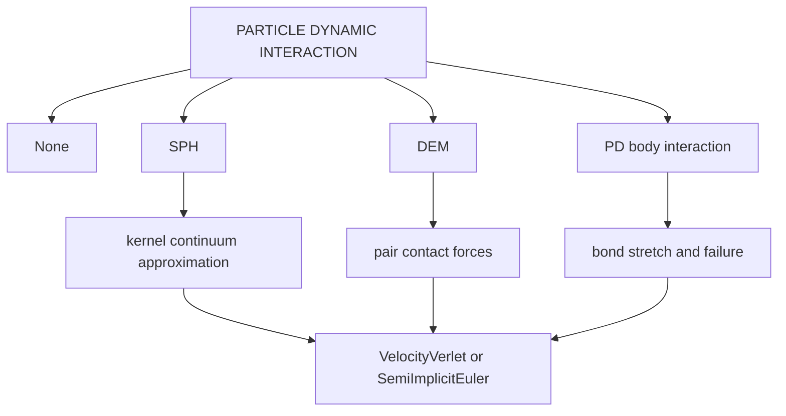

# Particle methods theory and input controls

Particle decks use [PARTICLE DYNAMIC](../reference/particle-dynamic.md), particle material selectors, and a `PARTICLES` legacy section or particle generation. Source entrypoints include `src/particle/src/4C_particle_input.cpp` and particle algorithm/engine modules.

## Shared particle time integration

`DYNAMICTYPE` selects particle state update:

- `VelocityVerlet` default: second-order explicit update of positions and velocities, common for conservative particle dynamics.
- `SemiImplicitEuler`: first-order symplectic-like update, used by no-interaction/gravity examples.

The time loop is controlled by `TIMESTEP`, `NUMSTEP`, `MAXTIME`, `RESULTSEVERY`, and `RESTARTEVERY`. Gravity and damping are set by `GRAVITY_ACCELERATION`, `GRAVITY_RAMP_FUNCT`, and `VISCOUS_DAMPING`.

## SPH

Smoothed particle hydrodynamics represents a continuum field by particles and a smoothing kernel \(W_h\):

\[
f(\mathbf x) \approx \sum_b f_b \frac{m_b}{\rho_b} W_h(\mathbf x - \mathbf x_b).
\]

Momentum and density equations are discretized by kernel gradients and pairwise particle interactions. Inputs map to the discretization:

- `KERNEL` and `KERNEL_SPACE_DIM` choose \(W_h\) and its dimensional normalization.
- `INITIALPARTICLESPACING` sets the nominal particle spacing and smoothing scale context.
- `EQUATIONOFSTATE` maps density to pressure, e.g. generalized Tait.
- `MOMENTUMFORMULATION`, `DENSITYEVALUATION`, and `DENSITYCORRECTION` choose discrete forms.
- `BOUNDARYPARTICLEFORMULATION`, `BOUNDARYPARTICLEINTERACTION`, and `WALLFORMULATION` choose wall/boundary handling.
- `MAT_ParticleSPHFluid` supplies initial radius/density, EOS exponent/background pressure, viscosity, bulk modulus, and thermal constants.

## DEM

Discrete element method treats particles as bodies, usually spheres, interacting through contact laws. For particles \(i,j\), overlap \(\delta_n\) generates normal force; damping and tangential/rolling/adhesion laws add dissipative and frictional terms.

Inputs:

- `INTERACTION: "DEM"` and `PARTICLE DYNAMIC/DEM` activate DEM controls.
- `NORMALCONTACTLAW` selects linear spring, spring-dashpot, Hertz, Lee-Herrmann, Kuwabara-Kono, or Tsuji normal law.
- `NORMAL_DAMP`, `COEFF_RESTITUTION`, `DAMP_REG_FAC`, and `REL_PENETRATION` control damping/contact regularization.
- Rolling friction and adhesion use `FRICT_COEFF_ROLL`, `ADHESION_*` keys.
- `MAT_ParticleDEM` supplies particle radius and density; `MAT_ParticleWallDEM` supplies wall interaction defaults.

## Peridynamics

Peridynamics models a body by material points connected by bonds over a finite horizon. Bond stretch controls force and failure:

\[
s = \frac{|\mathbf y_j - \mathbf y_i| - |\mathbf x_j - \mathbf x_i|}{|\mathbf x_j - \mathbf x_i|}.
\]

A bond fails when stretch exceeds a critical value. Inputs:

- `PD_BODY_INTERACTION: true` and `PARTICLE DYNAMIC/PD` activate peridynamic body interaction.
- `PERIDYNAMIC_GRID_SPACING` sets point spacing.
- `MAT_ParticlePD` supplies `YOUNG` and `CRITICAL_STRETCH`.
- `PRE_CRACKS` seeds broken bonds or crack definitions.
- `IMPACTOR_VELOCITY` configures impact examples.

This diagram maps particle interaction choices to their force models and shared time integration.

## Choosing an example family

Particle input has many feature-specific keys. Start from a test with the same interaction: `tests/input_files/particle_sph_*` for SPH, `tests/input_files/particle_dem_*` for DEM, and `tests/input_files/particle_sph_*pdbody*` for peridynamics.
