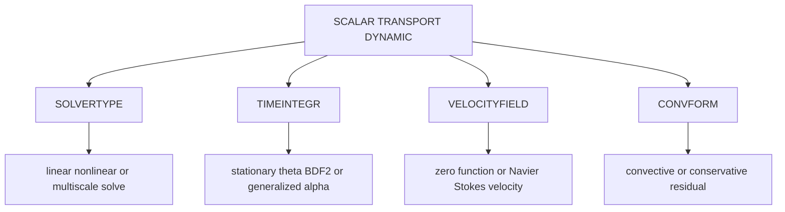

# Scalar transport theory and input controls

Scalar transport decks are configured by [SCALAR TRANSPORT DYNAMIC](../reference/scalar-transport-dynamic.md), scalar materials, transport elements, and transport boundary conditions. The input registry is `src/inpar/4C_inpar_scatra.cpp`; implementations live under `src/scatra` and `src/scatra_ele`.

## Governing equation

For scalar concentration or temperature-like quantity \(\phi\), the canonical model is convection-diffusion-reaction:

\[
\partial_t \phi + \nabla\cdot(\phi \mathbf u) - \nabla\cdot(D\nabla\phi) = r(\phi,\mathbf x,t) + s.
\]

In non-conservative form:

\[
\partial_t \phi + \mathbf u\cdot\nabla\phi - \nabla\cdot(D\nabla\phi) = r + s.
\]

`CONVFORM` chooses `conservative` or `convective`. On deforming domains, volume-referenced concentrations should use conservative form; `IS_INTENSIVE_SCALAR: true` states that the scalar is an intensive/material quantity and permits non-conservative form.

## Spatial discretization

Scalar fields are expanded in finite-element shape functions. `MAT_scatra/DIFFUSIVITY` supplies \(D\); reaction materials provide stoichiometry and coefficients. Boundary conditions set Dirichlet values or Neumann fluxes.

Stabilization and high-Peclet controls include:

- `FSSUGRDIFF` for fine-scale subgrid diffusivity.
- Scalar stabilization subsection controls from `all_specs_for_scatra_stabilization()`.
- HDG-specific element definitions under `src/scatra_ele/4C_scatra_ele_hdg.cpp` for hybridizable discontinuous Galerkin scalar transport.

## Time integration

| `TIMEINTEGR` | Role | Keys |
|---|---|---|
| `Stationary` | Steady convection-diffusion-reaction solve. | nonlinear solver and `LINEAR_SOLVER`. |
| `One_Step_Theta` | Theta-method transient solve. | `TIMESTEP`, `THETA`. |
| `BDF2` | Second-order backward-difference transient solve. | `TIMESTEP`, `NUMSTEP`, starting history. |
| `Gen_Alpha` | Generalized-alpha transient solve. | `ALPHA_M`, `ALPHA_F`, `GAMMA`. |

This diagram maps scalar input controls to the residual and solve strategy.

## Velocity and coupling

`VELOCITYFIELD` selects advection source:

- `zero`: pure diffusion/reaction unless external force or other coupling adds transport.
- `function`: velocity comes from `VELFUNCNO`.
- `Navier_Stokes`: velocity is coupled from a fluid field.

`FIELDCOUPLING` chooses `matching` or `volmortar` coupling between fields. Artery, S2I, electrochemistry, and multiphase variants add specialized sections but still rely on the scalar transport dynamic core.

For scalar-fluid coupling, `ScaTraAlgorithm::prepare_time_loop_two_way` checks that the fluid algorithm uses one of the supported fluid `TIMEINTEGR` schemes: `Af_Gen_Alpha`, `BDF2`, `One_Step_Theta`, or `Stationary`. `Np_Gen_Alpha` is handled in other scalar-fluid code paths but is not accepted by this two-way natural-convection check. During `prepare_time_step_convection`, the same supported set passes scalar density fields (`densafnp`) to the fluid discretization; density time derivatives are dummy/zero for OST and BDF2. Therefore, when `VELOCITYFIELD: Navier_Stokes` or a coupled electrochemistry/scalar-fluid setup is used, choose fluid `TIMEINTEGR` from that supported set or from a directly matching accepted example, and keep scalar density/material fields consistent with the fluid discretization.

## Nonlinear solve

`SOLVERTYPE: nonlinear` activates nonlinear residual iteration. `SCALAR TRANSPORT DYNAMIC/NONLINEAR` controls outer tolerances and iteration limits. `LINEAR_SOLVER` references [Solvers](../reference/solvers.md). `FDCHECK` can compare analytical and finite-difference Jacobians for debugging.
