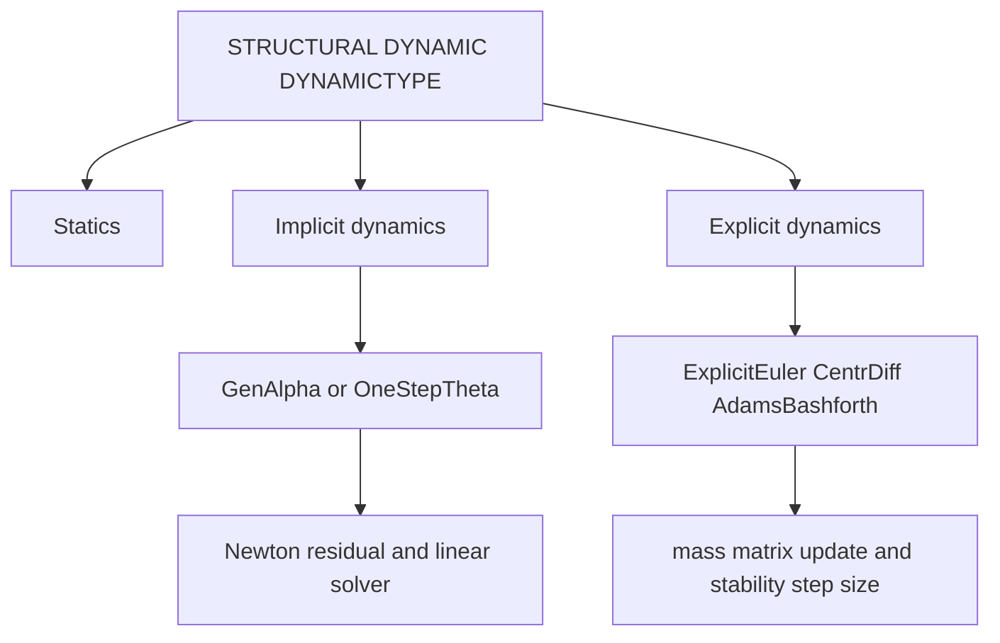

# Structural mechanics theory and input controls

4C structural decks configure the structural mechanics solver through [STRUCTURAL DYNAMIC](../reference/structural-dynamic.md), structural element definitions, materials, and boundary conditions. The input registry is in `src/inpar/4C_inpar_structure.cpp`; solver factories and integrators live under `src/structure`, `src/structure_new`, `src/solid_3D_ele`, and beam/shell element modules.

## Governing equations

For a continuum body in reference domain \(\Omega_0\), the structural balance solved by the finite-element model is the weak form of momentum balance:

\[
\rho_0 \ddot{\mathbf u} - \nabla_0 \cdot \mathbf P = \rho_0 \mathbf b \quad \text{in } \Omega_0,
\]

with displacement \(\mathbf u\), deformation gradient \(\mathbf F = \mathbf I + \nabla_0 \mathbf u\), first Piola stress \(\mathbf P\), reference density \(\rho_0\), body force \(\mathbf b\), Dirichlet displacement constraints, and Neumann tractions. Static analysis drops inertia. Beam, shell, truss, membrane, poro, and solid elements specialize the kinematics and constitutive response but share the same residual/Jacobian pattern.

The weak residual has the form:

\[
\mathbf R(\mathbf d, \dot{\mathbf d}, \ddot{\mathbf d}) = \mathbf f_{int}(\mathbf d) + \mathbf f_{damp}(\dot{\mathbf d}) + \mathbf M \ddot{\mathbf d} - \mathbf f_{ext}(t) - \mathbf f_{constr}.
\]

Inputs that map directly onto this residual:

- `MATERIALS` chooses constitutive law and density.
- `DAMPING`, `M_DAMP`, `K_DAMP` add Rayleigh or material damping.
- `LOADLIN` controls linearization of follower loads.
- `PRESTRESS*` controls prestress initialization.
- `TOLDISP`, `TOLRES`, `TOLCONSTR`, and norm-combination keys define nonlinear convergence.
- `NLNSOL`, line-search keys, and `MATERIALTANGENT` control Newton linearization.

## Spatial discretization

The displacement field is expanded in element shape functions \(N_a\):

\[
\mathbf u_h(\mathbf X,t) = \sum_a N_a(\mathbf X)\mathbf d_a(t).
\]

Element definitions in [Geometry and elements](../reference/geometry-and-elements.md) choose the interpolation and kinematics. Examples:

- `SOLID` element families for 3D continuum mechanics.
- `BEAM3R`, `BEAM3EB`, and related beam elements for geometrically exact or beam-specific kinematics.
- Shell/membrane element families for surface structures.

`SHAPEFCT` in `PROBLEM TYPE` defaults to polynomial shape functions. NURBS decks add `<FIELD> KNOTVECTORS`.

## Time integration schemes

`STRUCTURAL DYNAMIC/DYNAMICTYPE` selects the structural time integrator:

| `DYNAMICTYPE` | Theory role | Key controls |
|---|---|---|
| `Statics` | Solves \(\mathbf f_{int}(\mathbf d) - \mathbf f_{ext}=0\) over load/time steps without inertia. | `TIMESTEP`, `NUMSTEP`, `MAXTIME`, Newton tolerances, `LINEAR_SOLVER`. |
| `GenAlpha` | Implicit generalized-alpha method for second-order dynamics with controllable high-frequency dissipation. | `STRUCTURAL DYNAMIC/GENALPHA`: `RHO_INF`, `ALPHA_M`, `ALPHA_F`, `BETA`, `GAMMA`, `GENAVG`. |
| `GenAlphaLieGroup` | Generalized-alpha variant for Lie-group rotational degrees of freedom, used by beam/rotation-heavy examples. | Same generalized-alpha controls plus beam rotational kinematics. |
| `OneStepTheta` | One-step theta method, implicit for `THETA > 0`; midpoint/trapezoidal-like at `THETA=0.5`. | `STRUCTURAL DYNAMIC/ONESTEPTHETA/THETA`. |
| `ExplicitEuler` | Explicit first-order update; usually requires small stable time steps and often mass lumping. | `LUMPMASS`, `MODIFIEDEXPLEULER`, `TIMESTEP`. |
| `CentrDiff` | Central-difference explicit dynamics. | `LUMPMASS`, damping, time-adaptivity settings. |
| `AdamsBashforth2`, `AdamsBashforth4` | Explicit multistep schemes. | `TIMEADAPTIVITY` and step-size ratio limits matter. |

This diagram shows how the `DYNAMICTYPE` input routes to solver families.

## Nonlinear solve lifecycle

For implicit/static analysis, each step performs predictor, residual assembly, tangent assembly, linear solve, update, and convergence check. Input controls:

1. `PREDICT` initializes the step iterate.
2. `NLNSOL` chooses full Newton, modified Newton, line-search Newton, PTC, Uzawa, NOX, or single-step behavior.
3. `MAXITER` and `MINITER` bound nonlinear iterations.
4. `LINEAR_SOLVER` points to [Solvers](../reference/solvers.md).
5. `DIVERCONT` decides whether failure stops, repeats, halves/adapts step, or continues.

## Boundary and material coupling

Structural boundary conditions use [Design condition sections](../reference/conditions.md). A structural element line's `MAT` id must point to a structural-compatible material in [Materials](../reference/materials.md). Contact adds [CONTACT DYNAMIC](../reference/contact-dynamic.md) and [Contact theory](contact.md).
